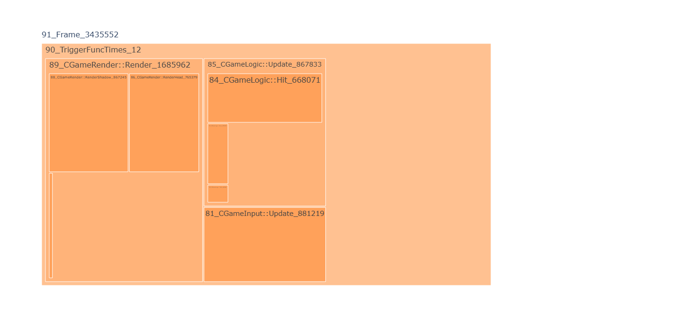

# ProfileSys
 Profile Your CPP Code with Insert Marks

# How TO?
- 生成 **profile_sys.dll**
  - 编译 profile_sys.sln
  - 复制 profile_sys.dll 到你 *.exe 目录
- 复制dll相关头文件到你的工程
  - [dllheader](./Profile/profile_sys/include/game_profile_sys.h)
  - [helperheader](./Profile/profile_sys/include/game_profile_sys_helper.h)
- 修改脚本 [codeInsert.py](./Profile/tools/codeInsert.py)
  - 修改函数实现 **insertGameExample()**
    - **include_str** : 这里是 helperheader 所复制到的目录，确保你的代码能找到
    - **insertPath(code_dir)** : 需要加分析节点的代码所在目录
      - 如果你代码目录有很多个，添加代码：insertPath(code_dir2); insertPath(code_dir3)...
    - **saveFuncDic(out_dict_dir)**
      -  保存"fuct_dict*.log"的目录，需要确保目录存在。这个目录后续还会用到
 -  运行脚本 [codeInsert.py](./Profile/tools/codeInsert.py)
    -  将out_dict_dir目录中出现一个 "fuct_dict*.log" 文件
 -  在你的工程中添加开始 **Start** 和结束 **End** 代码
    -  Start Code like this:
    ```
    if (g_profile_sys)
    {
      g_profile_sys->start();
    }
    ```
    -  End Code like this:
    ```
    if (g_profile_sys)
    {
      g_profile_sys->dump2File(time(nullptr));
    }
    ```
 -  编译生成你的工程
 -  修改配置文件 [config](./Profile/profile_sys/game_profile_sys.xml), 然后复制到你的 *.exe目录
    -  open_wpr: 1 会在start时运行cmd命令使用 wpr.exe记录etw events. 0 不使用wpr
    -  marker_frame_id: 必须是-1,如果你的工程的主循环 **mainloop** 添加了 "CGameProFile(-1)" ,后面analysisWithUI.py会帮助你生成单帧的图
    -  marker_record_frame_time: 函数消耗时间大于此值，将记录，否则不记录
    -  log_file_dir: 结束代码**End**执行时会在此目录生成 "profileTest*.log"文件 , 后续我们会用到"profileTest*.log" 文件
 -  运行你的exe
    - 当结束**End**执行后，将获得一个 "profileTest*.log" 文件
- 执行脚本 [addFuncName.py](./Profile/tools/addFuncName.py)
  - 执行函数 **processOneLog(profileLog, DictDir)**
    - **profileLog** is "profileTest*.log"
    - **DictDir** 是 "fuct_dict*.log" 所在目录
  - 执行完毕，会获得一个"profileTest*func.log" 文件
- 生成图, 执行脚本 [treePlot.py](./Profile/tools/treePlot.py)
  - func "main(file , start , end)"
    - **file** is "profileTest*func.log"
    - **start**: 你想要的图开始的文件行号
    - **end** : 你想要的图结束的文件行号
    - GameExample 生成图示例:
      - 
- 更多
  - 一个简单的UI界面
    - 如果你代码主循环函数 **mainloop**中有 "CGameProFile(-1)" 代码
    - 脚本[analysisWithUI.py](./Profile/tools/analysisWithUI.py) 会有个简单的界面供你使用
      - frame 过滤了单帧时间 15000us
        - 如果你要修改，修改此处代码 ：resultAna.processOneFile(or_file, fileName1, 15000)
  - 第一次尝试
    - 你可以使用 [GameExample](./Profile/profile_sys/examples/GameExample/GameExample.sln)进行第一次尝试