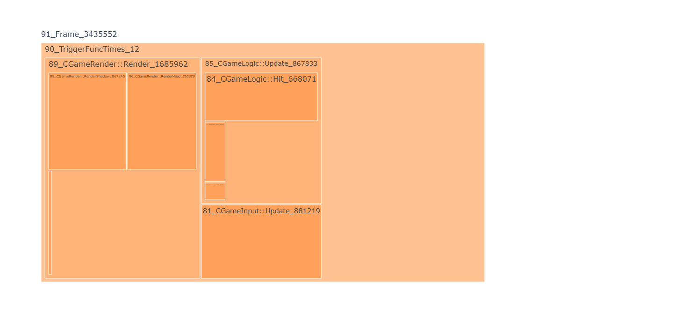

# ProfileSys
 Profile Your CPP Code with Insert Marks
 [github](https://github.com/FlowingMark/ProfileSys)
# How TO?
- generate **profile_sys.dll**
  - build profile_sys.sln
  - copy profile_sys.dll to your *.exe dir
- copy headers into your project include dir
  - [dllheader](./Profile/profile_sys/include/game_profile_sys.h)
  - [helperheader](./Profile/profile_sys/include/game_profile_sys_helper.h)
- Change Script [codeInsert.py](./Profile/tools/codeInsert.py)
  - change func **insertGameExample()**
    - **include_str** : your include dir 
    - **insertPath(code_dir)** : code dir you need add marks.
      - you can add more dirs if you want: add lines insertPath(code_dir2); insertPath(code_dir3)...
    - **saveFuncDic(out_dict_dir)**
      -  which dir to save "fuct_dict*.log"
 -  Then Run Script [codeInsert.py](./Profile/tools/codeInsert.py)
    -  you got a "fuct_dict*.log" file in the **out_dict_dir**, later we will use it
 -  add **Start** And **End** in your project
    -  Start Code like this:
    ```
    if (g_profile_sys)
    {
      g_profile_sys->start();
    }
    ```
    -  End Code like this:
    ```
    if (g_profile_sys)
    {
      g_profile_sys->dump2File(time(nullptr));
    }
    ```
 -  Build your project
 -  Change the [config](./Profile/profile_sys/game_profile_sys.xml), And Copy to your *.exe dir
    -  open_wpr: 1 will use wpr.exe to recrod etw events. 0 not use wpr
    -  marker_frame_id: must be -1, And if your Game **mainloop** has a "CGameProFile(-1)" code ,later tools will help you generate a "frame treemap"
    -  marker_record_frame_time: if functions cost time bigger than this value, fucntion will record , else no record
    -  log_file_dir: dir for log "profileTest*.log" , we will use the "profileTest*.log" later
 -  Run your Code
    - when End Code executed! We will get a "profileTest*.log" 
- Run Script [addFuncName.py](./Profile/tools/addFuncName.py)
  - call func **processOneLog(profileLog, DictDir)**
    - **profileLog** is "profileTest*.log"
    - **DictDir** is dir where "fuct_dict*.log" in
  - now we got "profileTest*func.log"
- Generate a graph, Run Script [treePlot.py](./Profile/tools/treePlot.py)
  - func "main(file , start , end)"
    - **file** is "profileTest*func.log"
    - **start**: file line num you want your graph start
    - **end** : file line num you want your graph end 
  - GameExample Graph like this:
  - 
- More
  - Frame Helper
    - if your Game **mainloop** has a "CGameProFile(-1)" code
    - [analysisWithUI.py](./Profile/tools/analysisWithUI.py) has a simple ui help you. 
      - frame is filter by 15000us
        - you can change it! code is here: resultAna.processOneFile(or_file, fileName1, 15000)
    - Firt Try
      - You can use [GameExample](./Profile/profile_sys/examples/GameExample/GameExample.sln) to do your first try